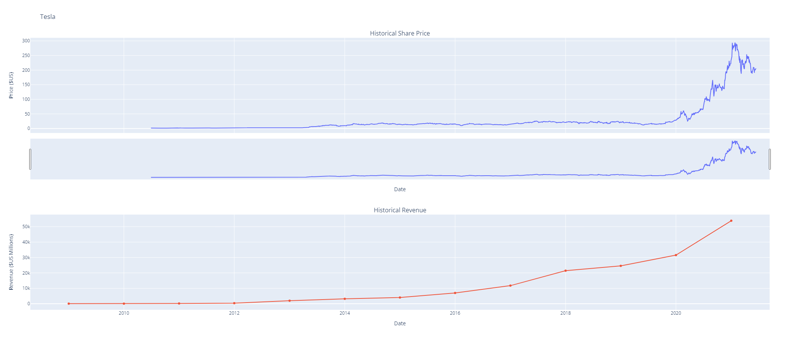
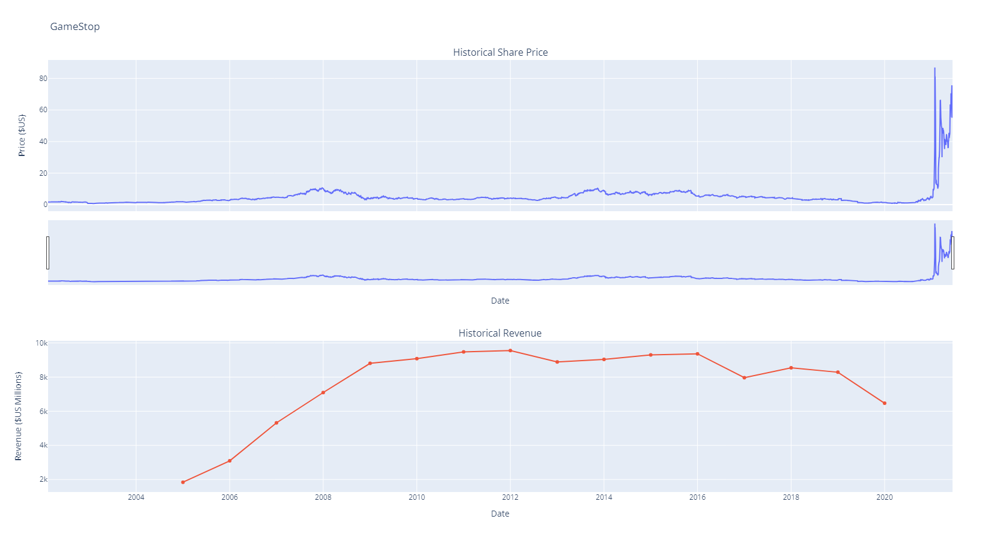
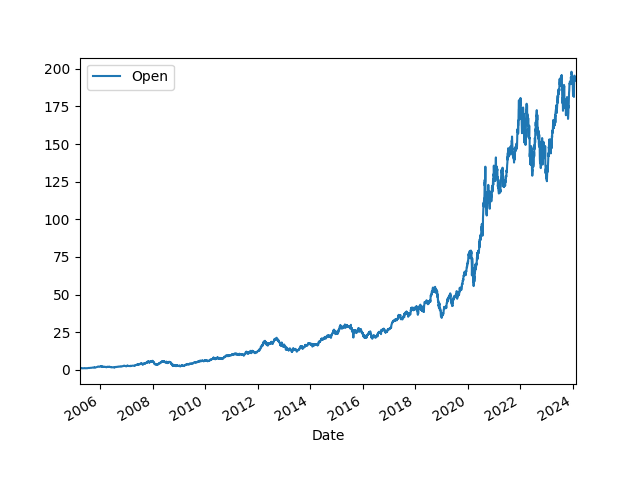

# IBM Data Science project assignment - Analyze Stock Data

In this lab I'm Analyze and Visualize Stock Data of Tesla and GameStop Revenue using data from Yahoo Finance API.
And others stocks like Apple, AMD, Netflix and Amazon.

## Demonstration of Result

### Plot Tesla Stock Graph

- [run code path: `stock-analyze\main.py`](https://github.com/dotpep/stock-analyze/blob/main/stock-analyze/main.py)

### Plot GameStop Stock Graph

- [run code path: `stock-analyze\main.py`](https://github.com/dotpep/stock-analyze/blob/main/stock-analyze/main.py)

### Plot Apple Stack data Graph

- [run code path: `stock-graph\apple_stock_data_graph.py`](https://github.com/dotpep/stock-analyze/blob/main/stock-graph/apple_stock_data_graph.py)

## Using Technology

- Jupyter Notebook
- IBM cloud, IBM Watson Studio
- Yahoo Finance API
- Webscraping using BeautifulSoup
- yfinance to extract stock data
- pandas
- matplotlib
- plotly

## Installation

- You can 1. clone nessacarry graphs file 2. install dependencies 3. run this code and you must see results of stock graph visualization with matplotlib and plotly.

## Resources

- [My IBM Data Science GitHub repo](https://github.com/dotpep/python-sample-space/tree/master/IBM_Data_Science_Professional_Certificates_coursera)
- [IBM](https://www.coursera.org/learn/python-project-for-data-science)
