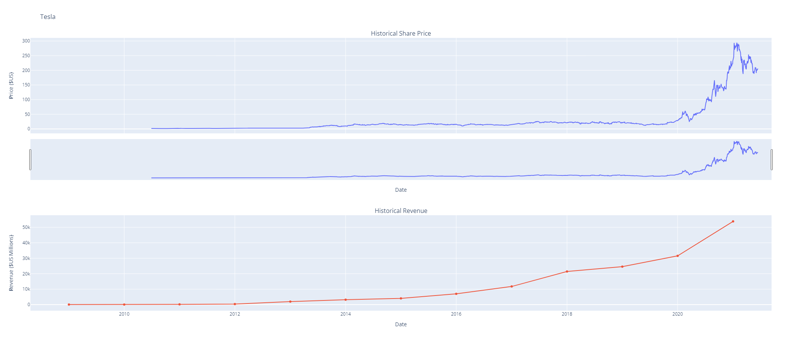
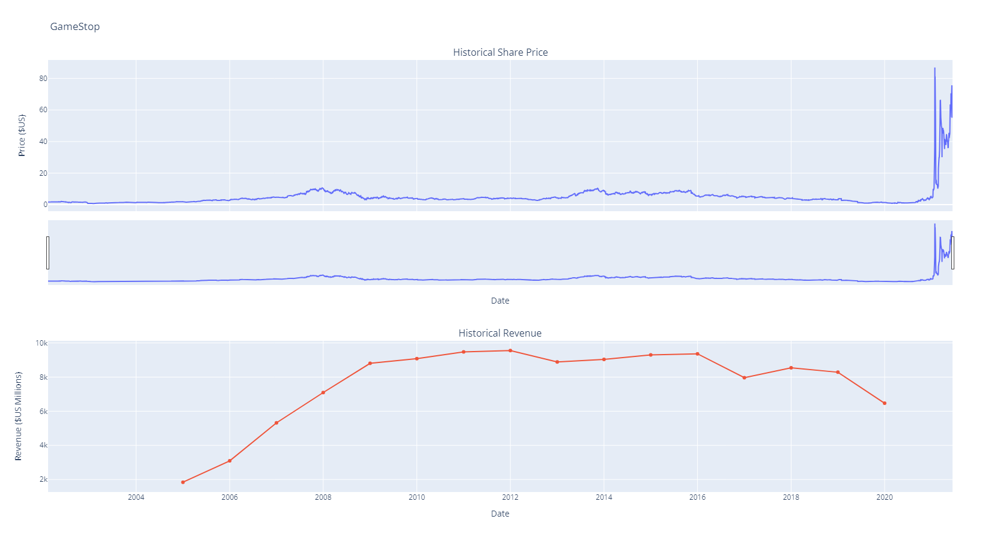

# IBM Data Science project assignment - Analyze Stock Data

In this lab I'm Analyze and Visualize Stock Data of Tesla and GameStop Revenue using data from Yahoo Finance API.
And others stocks like Apple, AMD, Netflix and Amazon.

## Demonstration of Result

### Plot Tesla Stock Graph

### Plot GameStop Stock Graph

## Using Technology

- Jupyter Notebook
- IBM cloud, IBM Watson Studio
- Yahoo Finance API
- Webscraping using BeautifulSoup
- yfinance to extract stock data
- pandas
- matplotlib
- plotly

## Resources

- [My IBM Data Science GitHub repo](https://github.com/dotpep/python-sample-space/tree/master/IBM_Data_Science_Professional_Certificates_coursera)
- [IBM](https://www.coursera.org/learn/python-project-for-data-science)
